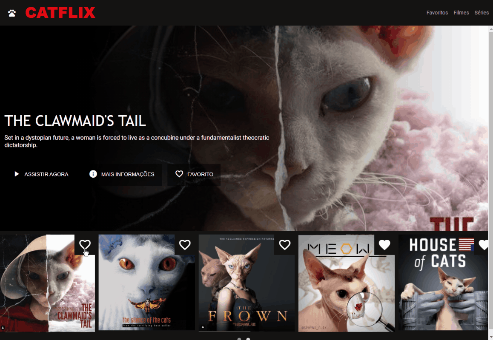
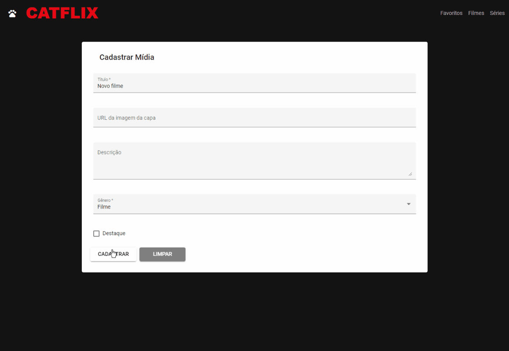

# CRUD de filmes e séries
Projeto criado a partir das atividades "Técnicas avançadas em Angular 8", de [Renan Rafael Bertoldo](https://github.com/RenanRB/curso-angular), e "Recriando a Interface do Netflix", de [Felipe Aguiar](https://github.com/felipeAguiarCode/netflix-clone), da [Digital Innovation One](https://digitalinnovation.one/).

Funções implementadas:
* Página de cadastro
* Visualização de imagens utilizando [ngx-owl-carousel-o](https://www.npmjs.com/package/ngx-owl-carousel-o)
* Carregamento de imagens utilizando [ngx-infinite-scroll](https://www.npmjs.com/package/ngx-infinite-scroll)
* Simulação de banco de dados local utilizando [json-server](https://www.npmjs.com/package/json-server#getting-started)

## Instruções:
1) Para iniciar o banco de dados local, instalar o [json-server](https://www.npmjs.com/package/json-server#getting-started),entrar na pasta do projeto pelo prompt de comando e digitar:
json-server --watch db.json

2) Para iniciar a aplicação, entrar na pasta do projeto pelo prompt de comando e digitar:
ng serve

3) No navegador, acessar o endereço http://localhost:4200/

&nbsp;

## Demonstração
### Utilização do owl-carousel-o:

&nbsp;

### Infinite loading:

&nbsp;

### CRUD e filtro

&nbsp;

Crédito das imagens utilizadas no projeto: [sphynx_flix](https://www.instagram.com/sphynx_flix/)

&nbsp;

This project was generated with [Angular CLI](https://github.com/angular/angular-cli) version 11.0.2.

## Development server

Run `ng serve` for a dev server. Navigate to `http://localhost:4200/`. The app will automatically reload if you change any of the source files.

## Code scaffolding

Run `ng generate component component-name` to generate a new component. You can also use `ng generate directive|pipe|service|class|guard|interface|enum|module`.

## Build

Run `ng build` to build the project. The build artifacts will be stored in the `dist/` directory. Use the `--prod` flag for a production build.

## Running unit tests

Run `ng test` to execute the unit tests via [Karma](https://karma-runner.github.io).

## Running end-to-end tests

Run `ng e2e` to execute the end-to-end tests via [Protractor](http://www.protractortest.org/).

## Further help

To get more help on the Angular CLI use `ng help` or go check out the [Angular CLI Overview and Command Reference](https://angular.io/cli) page.
